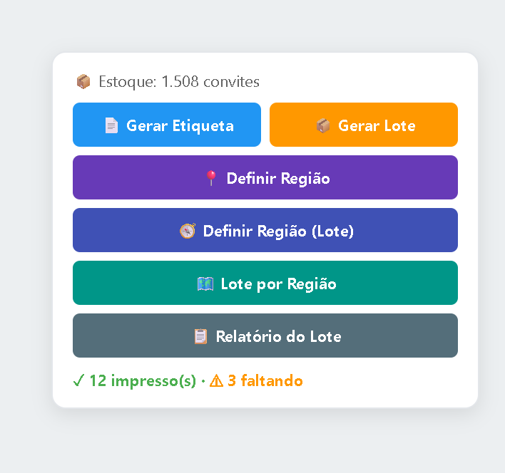
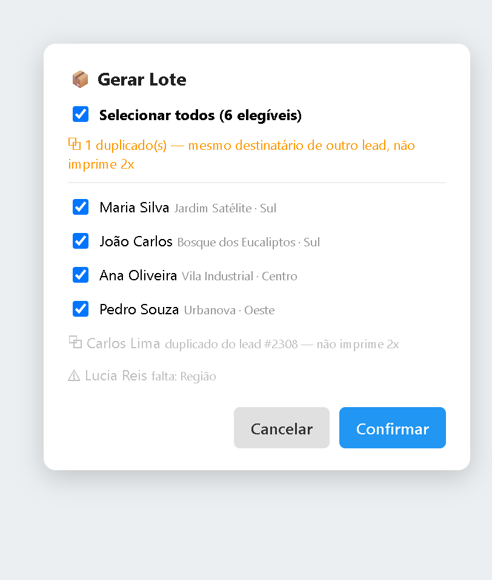
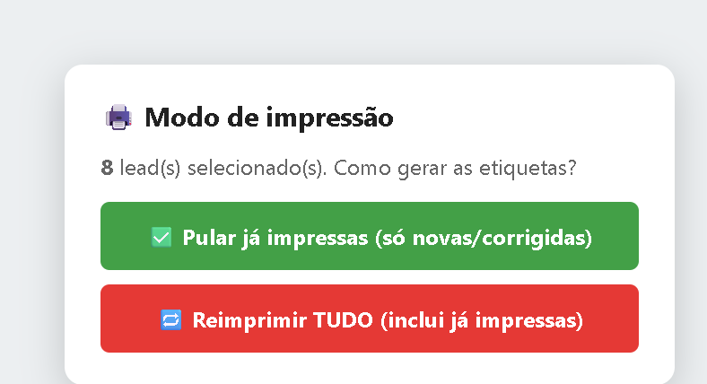

# Manual dos Botões — Widget de Etiquetas (Kommo)

Este widget fica dentro do cartão da pessoa (lead) no Kommo. Com ele você gera as etiquetas de papel da campanha, define a região e confere o que já saiu.
Os botões fazem o trabalho pesado: leem os dados, pulam quem já foi impresso e não gastam convite à toa.

**Regra de ouro:** o sistema ajuda muito, mas 3 coisas ainda pedem o seu olho — se a etiqueta saiu mesmo no papel, se a região de bairro de divisa está certa, e se a pessoa marcada como "duplicada" é mesmo a mesma pessoa.

> **Atenção a um botão:** o **📄 Gerar Etiqueta (1 pessoa)** SEMPRE manda para a impressora, mesmo que a pessoa já tenha sido impressa antes. Os botões de **lote** não fazem isso — eles pulam quem já saiu. Detalhes na Seção 5.

> **Antes de começar — 7 palavras que você vê o tempo todo:**
> - **Lead** = a pessoa do cartão (nome, endereço).
> - **Lote** = um grupo de pessoas processadas de uma vez (a etapa inteira ou uma região).
> - **Convite / Estoque** = quantas etiquetas você ainda pode imprimir. O número aparece no topo do widget (📦 Estoque: X convites).
> - **Região** = uma das 6 zonas de São José dos Campos (Centro, Norte, Sul, Leste, Oeste, Sudeste). Sem região, a etiqueta NÃO sai.
> - **Etapa** = a coluna do quadro onde a pessoa está agora.
> - **Elegível** = pronto para imprimir (tem nome + endereço + região). **Não elegível** = falta um desses dados.
> - **Bairro de divisa** = bairro no limite entre duas zonas da cidade. Nesses casos nem o sistema tem certeza da região — ele avisa e deixa para você decidir.
>
> **As cores das mensagens:** ✓ verde = deu certo · ⚠ laranja = falta um dado (você completa) · ✗ vermelho = deu erro (tente de novo).

**O painel de botões** aparece dentro do cartão da pessoa, assim:

---

## 1. 🧭 Definir Região (Lote)

**Para que serve:** Descobre e grava a região de TODAS as pessoas da etapa de uma vez, pelo bairro/CEP.

**Quando usar**
- No começo do dia, antes de imprimir. É o primeiro passo.
- Quando o relatório mostra muita gente "sem região".

**Quando NÃO usar**
- Quando todo mundo da etapa já tem região (o sistema avisa "Todos tinham, pulados").
- Quando os cartões não têm bairro nem CEP preenchidos (não há de onde descobrir).

**Passo a passo**
1. Clique em **🧭 Definir Região (Lote)**.
2. Escolha o alcance: **Só quem está SEM região** (recomendado) ou **Todos (regrava todos)**.
3. Espere. O sistema lê todo mundo, descobre a região e grava.
4. Leia o resultado: "✓ N região(ões) gravada(s)" e a lista de quem ficou para revisar na mão.
5. Se aparecer lista de revisão, baixe o **⬇️ CSV** para conferir esses casos depois.

**✅ Pode confiar**
- Não gasta convite. Só grava o campo Região; não imprime nada.
- Bairro claro vira região sozinho, com segurança.
- Quem o sistema NÃO tem certeza (bairro de divisa, sem dado, ou outra cidade) ele NÃO chuta — separa para você decidir.

**👀 Confira sempre**
- A lista de "revisar manual": esses o sistema não resolveu de propósito. Abra o cartão, veja o endereço e defina a região na mão.
- Se gravou mas o cartão não mudou na tela: reabra/atualize o cartão (o Kommo às vezes demora).

---

## 2. 📍 Definir Região (1 pessoa)

**Para que serve:** Descobre e grava a região de SÓ esta pessoa, pelo bairro/CEP do cartão.

**Quando usar**
- Quando você está num cartão e falta só a região dele.
- Para corrigir a região de uma pessoa específica.

**Quando NÃO usar**
- Quando o cartão não tem bairro nem CEP.
- Para resolver muita gente de uma vez (use o **🧭 Definir Região (Lote)**).

**Passo a passo**
1. Abra o cartão da pessoa.
2. Clique em **📍 Definir Região** e confirme.
3. Leia a mensagem.

**✅ Pode confiar**
- Não gasta convite.
- Quando o sistema tem certeza, grava a região direto no cartão.
- Depois de gravar, ele RELÊ o cartão para confirmar que pegou de verdade antes de mostrar o ✓ verde.

**👀 Confira sempre**
- Se vier **⚠ laranja "Sugestão: ... (confiança baixa)"**: o sistema NÃO gravou (é bairro de divisa — fica no limite entre duas zonas). Confira e defina na mão se a sugestão estiver certa.
- Se vier **⚠ "Sem opção para ..."**: a lista de regiões do Kommo não tem essa opção. Avise quem cuida do Kommo para criar a opção.
- Se vier **⚠ "Kommo aceitou mas não gravou"**: o campo continuou diferente. Atualize o cartão e tente de novo.

---

## 3. 📦 Gerar Lote

**Para que serve:** Imprime as etiquetas de várias pessoas da etapa de uma vez, com você marcando quem entra.

**Quando usar**
- O caso normal do dia: imprimir todo mundo da etapa que já está pronto.

**Quando NÃO usar**
- Quando ninguém da etapa está elegível (todos com dados faltando) — resolva os dados antes.

**Passo a passo**
1. Clique em **📦 Gerar Lote**.
2. Espere o sistema ler a etapa. Abre uma lista com caixinhas (✓) já marcadas.
3. Marque/desmarque quem você quer. Em cinza aparecem os que faltam dado e os duplicados (esses não dá para marcar).
4. Clique em **Confirmar**.
5. Escolha o modo: **✅ Pular já impressas** (recomendado) ou **🔁 Reimprimir TUDO**.
6. Confirme de novo. Aí sim ele gera e manda para a impressora.
7. Leia o resumo: quantas saíram, quantas foram puladas, quantos convites gastou.

A janela de seleção (passo 2) e a escolha do modo (passo 5) são assim:

**✅ Pode confiar**
- Nada é impresso antes das suas duas escolhas (marcar + escolher o modo). Quer desistir? Feche a janela.
- No modo "Pular já impressas", quem já tem etiqueta impressa (em qualquer etapa) é pulado — não imprime 2 vezes nem gasta convite.
- Duplicados (mesmo nome e endereço de outra pessoa) são pulados sempre, sem gastar convite.
- Só gasta 1 convite por etiqueta NOVA. Quem foi pulado ou é duplicado não gasta.

**👀 Confira sempre**
- Se aparecer **⚠ "Estoque insuficiente. Disponível: X, necessário: Y"** logo ao confirmar: faltou convite ANTES de começar. Nesse caso o lote NEM COMEÇA — nada foi impresso e nada foi gasto. Reponha os convites (precisa de Y) e rode de novo.
- Se aparecer **⚠ "Parou no meio do lote"**: os convites acabaram DURANTE a impressão. O que já saiu, valeu. Reponha os convites e rode de novo — ele continua de onde parou.
- A lista de duplicados: confira se é mesmo a mesma pessoa (mesmo nome + mesmo endereço). Se forem pessoas diferentes por coincidência, ajuste o cadastro antes.
- Depois de imprimir: olhe a bandeja da impressora e confira se a quantidade de papéis bate com o número "saíram" do resumo.

---

## 4. 🗺️ Lote por Região

**Para que serve:** Imprime só as pessoas de UMA região escolhida (ex.: só a Zona Sul).

**Quando usar**
- Para separar a entrega por zona da cidade.
- Quando você quer rodar uma região de cada vez.

**Quando NÃO usar**
- Quando ninguém da etapa tem aquela região preenchida no campo (defina a região antes, com o **🧭 Definir Região (Lote)**).

**Passo a passo**
1. Clique em **🗺️ Lote por Região**.
2. Escolha a região (Centro, Norte, Sul, Leste, Oeste ou Sudeste).
3. Daqui em diante é igual ao **Gerar Lote**: marque quem entra → Confirmar → escolha o modo → confirme.

**✅ Pode confiar**
- Ele filtra só quem JÁ tem aquela região gravada no campo. Este botão não descobre região — ele filtra.
- Quem está sem região fica de fora (não é "chutado" para dentro).
- As mesmas proteções do Gerar Lote valem: pula já-impressas e duplicados, gasta convite só nas novas.

**👀 Confira sempre**
- Se disser "Nenhum lead na região X": ou ninguém é dessa zona, ou falta gravar a região dessas pessoas. Rode o **🧭 Definir Região (Lote)** e volte aqui.
- Igual ao Gerar Lote: se faltar convite antes de começar, o lote nem inicia e avisa quanto falta; se acabar no meio, avisa que parou (o que saiu valeu).

---

## 5. 📄 Gerar Etiqueta (1 pessoa) — ATENÇÃO

**Para que serve:** Gera a etiqueta de SÓ esta pessoa do cartão aberto.

> ⚠ **LEIA ANTES:** diferente do lote, este botão NÃO pula quem já foi impresso. Se a pessoa já tinha etiqueta, ele manda OUTRA para a impressora (sai papel de novo). Use só quando reimprimir for mesmo a intenção.

**Quando usar**
- Para um caso isolado, fora do lote.
- Quando você QUER mesmo reimprimir a etiqueta de uma pessoa (impressora travou, papel borrou).

**Quando NÃO usar**
- Para imprimir várias pessoas (use o **📦 Gerar Lote**, que protege contra duplicar).
- Quando você só quer "checar" — este botão sempre manda para a impressora.

**Passo a passo**
1. Abra o cartão da pessoa.
2. Clique em **📄 Gerar Etiqueta** e confirme.
3. Leia a mensagem.

**✅ Pode confiar**
- Etiqueta nova gasta 1 convite. Reimpressão da mesma pessoa NÃO gasta.
- Se faltar um dado, ele avisa **⚠ "Campos faltando"** e diz qual — e não gasta convite.

**👀 Confira sempre**
- Lembre da caixa acima: este botão NÃO pula impressas. Se não quiser papel repetido, use o lote.
- Confira no papel se a etiqueta saiu.

---

## 6. 📋 Relatório do Lote

**Para que serve:** Mostra, para cada pessoa da etapa, o que já foi impresso e o que ainda falta.

**Quando usar**
- Depois de gerar o lote, para conferir o resultado.
- A qualquer momento, para saber quanto falta na etapa.

**Quando NÃO usar**
- Quando a etapa está vazia (ele avisa "Nenhum lead nesta etapa").

**Passo a passo**
1. Clique em **📋 Relatório do Lote**.
2. Espere. Aparece o resumo: "✓ N impresso(s) · ⚠ M faltando".
3. Clique em **📊 Abrir relatório** para ver o quadro colorido em nova aba.
4. Se quiser uma lista para Excel, clique em **⬇️ CSV**.

**Como ler as cores do relatório:**
- 🟩 **Impresso** — saiu da fila da impressora. (Confira na bandeja no que for importante.)
- 🟦 **Pendente** — está na fila. Só esperar a impressora puxar.
- 🟪 **Processando** — está imprimindo agora.
- 🟥 **Erro** — a impressão falhou. Veja o motivo e mande reimprimir.
- 🟧 **Sem etiqueta** — faltou um dado (nome, endereço ou região). Complete no cartão e gere de novo.
- 🟥 **Não gerada** — nunca gerou. Quase sempre falta a região, ou é de outra cidade.

**✅ Pode confiar**
- Conta por PESSOA: se o lead já foi impresso em qualquer etapa, aparece "Impresso" — mesmo que tenha mudado de coluna.
- O número "faltando" = tudo que ainda não foi impresso, junto. Abra o quadro colorido para ver o que é cada grupo e o que fazer.

**👀 Confira sempre**
- **"Impresso" aqui quer dizer: a etiqueta foi ENVIADA para a impressora e saiu da fila.** A confirmação de que o papel saiu mesmo ainda está em ajuste na impressora. Então, depois do lote, olhe a bandeja e confira se a quantidade de papéis bate com o número de "impressos" do relatório.
- "Faltando" nem sempre é problema: "Pendente" é só esperar; "Não gerada" costuma ser falta de região.

---

## Botões que aparecem dentro das janelas

| Botão | O que faz | Gasta convite? |
|---|---|---|
| **✅ Pular já impressas** | Gera só as novas e corrigidas; pula quem já saiu. **É o modo seguro.** | Sim, só nas novas. |
| **🔁 Reimprimir TUDO** | Força reimpressão de todas as selecionadas, inclusive as já impressas. Use só de propósito. | Não (reimpressão não gasta). |
| **🖨️ Imprimir não elegíveis (N)** | Força a etiqueta de quem está com dado faltando (sai com o que tiver; linhas vazias são puladas). Pede confirmação antes. | **Sim, gasta 1 por pessoa, mesmo faltando dado.** |
| **⬇️ CSV ...** | Baixa uma lista para o Excel (não elegíveis / relatório / revisão de região). | Não (só baixa lista). |
| **📊 Abrir relatório** | Abre o quadro colorido do relatório em nova aba. | Não (só mostra). |

> Sobre o **🖨️ Imprimir não elegíveis:** a etiqueta sai com qualidade reduzida (faltam dados). O melhor é completar os dados no cartão antes. Use esse botão só quando precisar imprimir mesmo assim.

---

## Onde o sistema é confiável × Onde conferir com o olho

| Assunto | ✅ Pode confiar no sistema | 👀 Precisa do seu olho |
|---|---|---|
| **Gastar convite** | Etiqueta nova gasta 1; reimpressão e duplicado não gastam. O número no topo atualiza sozinho. | Nada — pode confiar. |
| **Imprimir 2 vezes (no LOTE)** | Pula quem já foi impresso e os duplicados, por padrão. | Confirmar que o "duplicado" é mesmo a mesma pessoa. |
| **Imprimir 2 vezes (botão 📄 1 pessoa)** | — | **Este botão SEMPRE reimprime. Sai papel de novo.** Use só de propósito. |
| **"Impresso" no relatório** | Indica que foi enviada para a impressora e saiu da fila. | **Olhar a bandeja** e conferir se a quantidade de papéis bate com o número do sistema — a confirmação física ainda está em ajuste. |
| **Região automática** | Bairro claro vira região sozinho, com segurança. | Bairro de divisa / outra cidade: o sistema avisa "baixa confiança" e NÃO grava — você decide. |
| **Quem entra no lote** | Só elegíveis e não-duplicados são marcados. | Conferir a lista cinza (faltando dado) e completar os cartões. |
| **Faltou convite (antes do lote)** | Se não dá para todos, o lote NEM COMEÇA e avisa quanto falta — nada é impresso nem gasto. | Repor a quantidade que ele pediu e rodar de novo. |
| **Acabou o convite no meio** | Avisa "Parou no meio"; o que saiu, valeu. | Repor convites e rodar de novo (ele continua de onde parou). |

---

## No dia a dia, faça nesta ordem

1. **Defina a região de todo mundo** → clique em **🧭 Definir Região (Lote)** (modo "Só quem está SEM região"). Anote quem ficou para revisar na mão.
2. **Gere as etiquetas** → clique em **📦 Gerar Lote** (ou **🗺️ Lote por Região** para separar por zona). Marque quem entra e use o modo **✅ Pular já impressas**.
3. **Confira o resultado** → clique em **📋 Relatório do Lote** e abra o **📊 relatório colorido**. Resolva os grupos laranja/vermelho (faltou dado / erro).
4. **Confira a impressão de verdade** → olhe a bandeja da impressora e veja se a quantidade de papéis bate com o número de "impressos" do sistema. "Impresso" no sistema quer dizer "enviado para a impressora" — no que for importante, confirme com o olho.
